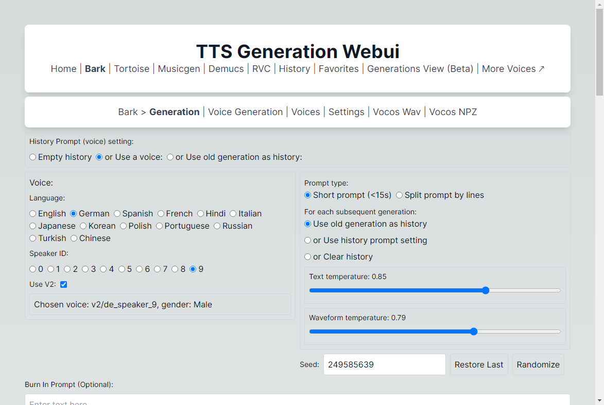
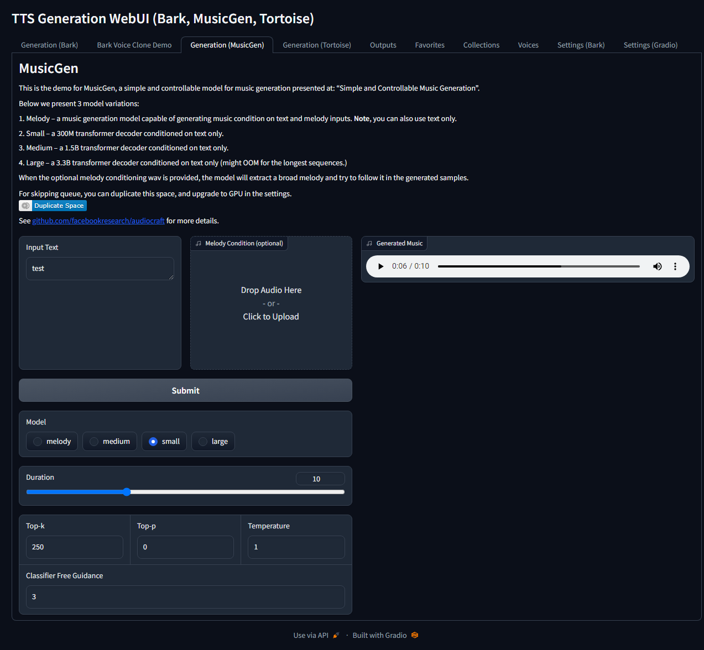
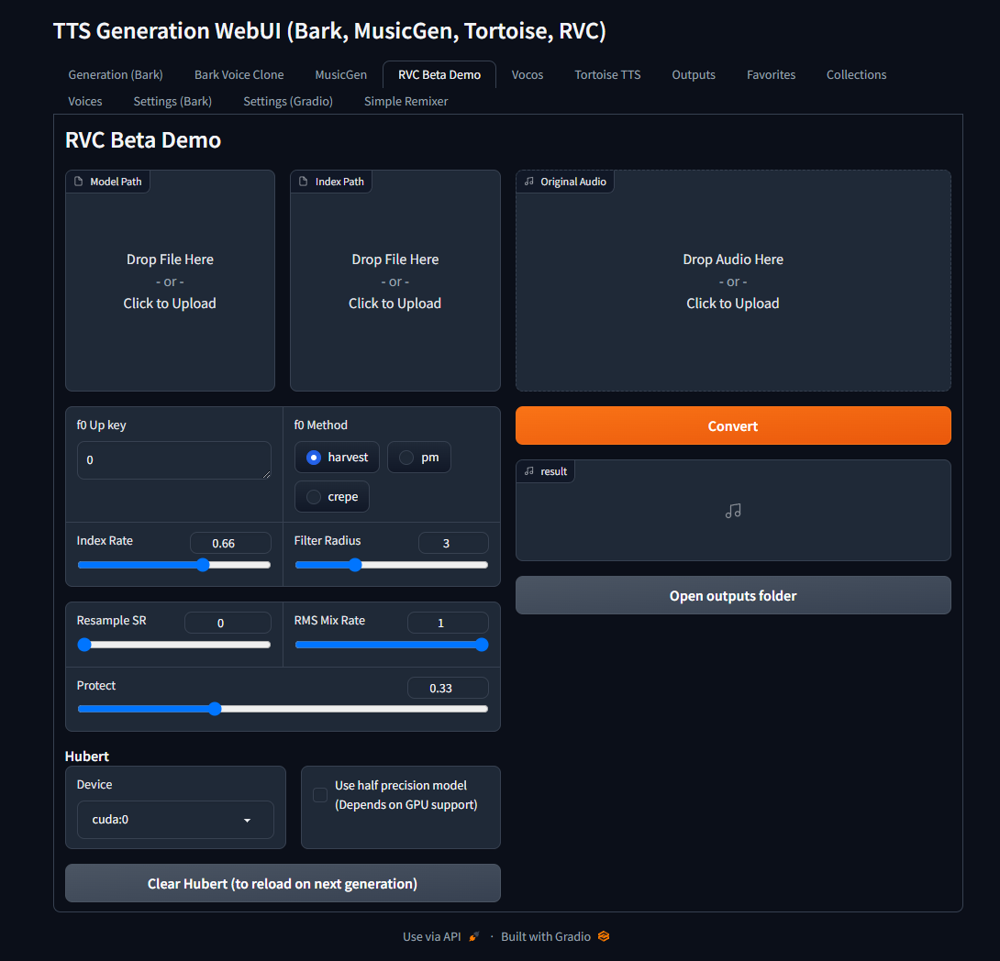
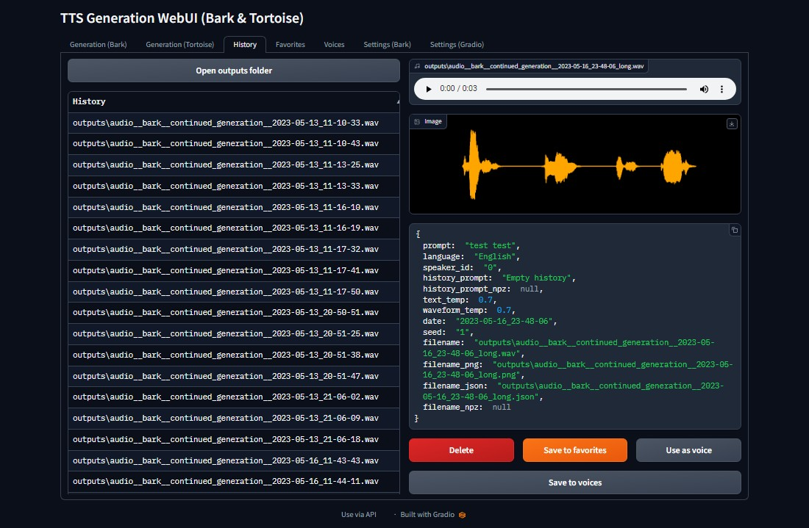

# TTS Generation WebUI (Bark, MusicGen + AudioGen, Tortoise, RVC, Vocos, Demucs, SeamlessM4T, MAGNeT)

## One click installers

[Download](https://github.com/rsxdalv/one-click-installers-tts/archive/refs/tags/v6.0.zip) ||
[Upgrading](#upgrading) ||
[Manual installation](#manual-installation)

Google Colab demo: [](https://colab.research.google.com/github/rsxdalv/tts-generation-webui/blob/main/notebooks/google_collab.ipynb)


*Note: Not all models support all platforms. For example, MusicGen and AudioGen are not supported on MacOS as of yet.*


## Videos

|                  **How To Use TTS Voice Generation Web UI With AI Voice Cloning Technology (Bark AI Tutorial)**                  |                  **TTS Generation WebUI - A Tool for Text to Speech and Voice Cloning**                             |                       **Text to speech and voice cloning - TTS Generation WebUI**                                |
| :------------------------------------------------------------------------------------------------------: | :------------------------------------------------------------------------------------------------------: | :------------------------------------------------------------------------------------------------------: |
| [](https://youtu.be/gYNCnltAHzY) | [](https://youtu.be/ScN2ypewABc) | [](https://youtu.be/JXojhFjZ39k) |

## Screenshots

|    |  |  |
| :-----------------------------------------: | :-----------------------------------------: | :-------------------------------: |
|  | .png>) | .png>) |


## Examples

[audio__bark__continued_generation__2023-05-04_16-07-49_long.webm](https://user-images.githubusercontent.com/6757283/236218842-b9dc253e-05de-49e5-ada9-e714e1e2cbd4.webm)

[audio__bark__continued_generation__2023-05-04_16-09-21_long.webm](https://user-images.githubusercontent.com/6757283/236219228-518d2b70-51a3-4175-af44-b24c01d14932.webm)

[audio__bark__continued_generation__2023-05-04_16-10-55_long.webm](https://user-images.githubusercontent.com/6757283/236219243-dad96404-0879-4274-828e-7f3afc6bac65.webm)

## Extra Voices for Bark
[](https://echo.ps.ai/)
https://rsxdalv.github.io/bark-speaker-directory/

## Bark Readme
[README_Bark.md](./README_Bark.md)

## Info about managing models, caches and system space for AI projects
https://github.com/rsxdalv/tts-generation-webui/discussions/186#discussioncomment-7291274

## Changelog
Apr 4:
* Upgrade RVC to include RVMPE and FCPE. Remove the direct file input for models and indexes due to file duplication. Improve React UI interface for RVC.

Mar 28:
* Add GPU Info tab

Mar 27:
* Add information about voice cloning to tab voice clone

Mar 26:
* Add Maha TTS demo notebook

Mar 22:
* Vall-E X demo via notebook (#292)
* Add React UI to Docker image
* Add install disclaimer

Mar 16:
* Upgrade vocos to 0.1.0

Mar 14:
* StyleTTS2 Demo Notebook

Mar 13:
* Add Experimental Pipeline (Bark / Tortoise / MusicGen / AudioGen / MAGNeT -> RVC / Demucs / Vocos) (#287)
* Fix RVC bug with model reloading on each generation. For short inputs that results in a visible speedup.

Mar 11:
* Add Play as Audio and Save to Voices to bark (#286)
* Change UX to show that files are deleted from favorites
* Fix images for bark voices not showing
* Fix audio playback in favorites

Mar 10:
* Add Batching to React UI Magnet (#283)
* Add audio to audio translation to SeamlessM4T (#284)

Mar 5:
* Add Batching to React UI MusicGen (#281), thanks to https://github.com/Aamir3d for requesting this and providing feedback

Mar 3:
* Add MMS demo as a notebook
* Add MultiBandDiffusion high VRAM disclaimer

Feb 21:
* Fix Docker container builds and bug with Docker-Audiocraft

Feb 8:
* Fix MultiBandDiffusion for MusicGen's stereo models, thank you https://github.com/mykeehu
* Fix Node.js installation steps on Google Colab, code by https://github.com/miaohf

Feb 6:
* Add FLAC file generation extension by https://github.com/JoaCHIP

Jan 21:
* Add CPU/M1 torch auto-repair script with each update. To disable, edit check_cuda.py and change FORCE_NO_REPAIR = True

Jan 16:
* Upgrade MusicGen, adding support for stereo and large melody models
* Add MAGNeT

Jan 15:
* Upgraded Gradio to 3.48.0
  * Several visual bugs have appeared, if they are critical, please report them or downgrade gradio.
  * Gradio: Suppress useless warnings
* Supress Triton warnings
* Gradio-Bark: Fix "Use last generation as history" behavior, empty selection no longer errors
* Improve extensions loader display
* Upgrade transformers to 4.36.1 from 4.31.0
* Add SeamlessM4T Demo

Jan 14:
* React UI: Fix missing directory errors

Jan 13:
* React UI: Fix missing npm build step from automatic install

Jan 12:
* React UI: Fix names for audio actions
* Gradio: Fix multiple API warnings
* Integration - React UI now is launched alongside Gradio, with a link to open it

Jan 11:
* React UI: Make the build work without any errors

Jan 9:
* React UI
  * Fix 404 handler for Wavesurfer
  * Group Bark tabs together

Jan 8:
* Release React UI

Oct 26:
* Improve model selection UX for Musicgen

Oct 24:
* Add initial React UI for Musicgen and Demucs (https://github.com/rsxdalv/tts-generation-webui/pull/202)
* Fix Bark long generation seed drifting (thanks to https://github.com/520Pig520)

Sep 21:
* Bark: Add continue as semantic history button
* Switch to github docker image storage, new docker image:
  * `docker pull ghcr.io/rsxdalv/tts-generation-webui:main`
* Fix server_port option in config https://github.com/rsxdalv/tts-generation-webui/issues/168 , thanks to https://github.com/Dartvauder

Sep 9:
* Fix xdg-open command line, thanks to https://github.com/JFronny
* Fix multi-line bark generations, thanks to https://github.com/slack-t and https://github.com/bkutasi
* Add unload model button to Bark as requested by https://github.com/Aamir3d
* Add Bark details to README_Bark.md as requested by https://github.com/Maki9009
* Add "optional" to burn in prompt, thanks to https://github.com/Maki9009

Sep 5:
* Add voice mixing to Bark
* Add v1 Burn in prompt to Bark (Burn in prompts are for directing the semantic model without spending time on generating the audio. The v1 works by generating the semantic tokens and then using it as a prompt for the semantic model.)
* Add generation length limiter to Bark

Aug 27:
* Fix MusicGen ignoring the melody https://github.com/rsxdalv/tts-generation-webui/issues/153

Aug 26:
* Add Send to RVC, Demucs, Vocos buttons to Bark and Vocos

Aug 24:
* Add date to RVC outputs to fix https://github.com/rsxdalv/tts-generation-webui/issues/147
* Fix safetensors missing wheel
* Add Send to demucs button to musicgen

Aug 21:
* Add torchvision install to colab for musicgen issue fix
* Remove rvc_tab file logging

Aug 20:
* Fix MBD by reinstalling hydra-core at the end of an update

Aug 18:
* CI: Add a GitHub Action to automatically publish docker image.

Aug 16:
* Add "name" to tortoise generation parameters

Aug 15:
* Pin torch to 2.0.0 in all requirements.txt files
* Bump audiocraft and bark versions
* Remove Tortoise transformers fix from colab
* Update Tortoise to 2.8.0

Aug 13:
* Potentially big fix for new user installs that had issues with GPU not being supported

Aug 11:
* Tortoise hotfix thanks to [manmay-nakhashi](https://github.com/manmay-nakhashi)
* Add Tortoise option to change tokenizer

Aug 8:
* Update AudioCraft, improving MultiBandDiffusion performance
* Fix Tortoise parameter 'cond_free' mismatch with 'ultra_fast' preset

Aug 7:
* add tortoise deepspeed fix to colab

Aug 6:
* Fix audiogen + mbd error, add tortoise fix for colab 


Aug 4:
* Add MultiBandDiffusion option to MusicGen https://github.com/rsxdalv/tts-generation-webui/pull/109
* MusicGen/AudioGen save tokens on generation as .npz files. 

Aug 3:
* Add AudioGen https://github.com/rsxdalv/tts-generation-webui/pull/105

Aug 2:
* Fix Model locations not showing after restart

July 26:
* Voice gallery
* Voice cropping
* Fix voice rename bug, rename picture as well, add a hash textbox
* Easier downloading of voices (https://github.com/rsxdalv/tts-generation-webui/pull/98)

July 24:
* Change bark file format to include history hash: ...continued_generation... -> ...from_3ea0d063...

July 23:
* Docker Image thanks to https://github.com/jonfairbanks
* RVC UI naming improvements

July 21:
* Fix hubert not working with CPU only (https://github.com/rsxdalv/tts-generation-webui/pull/87)
* Add Google Colab demo (https://github.com/rsxdalv/tts-generation-webui/pull/88)
* New settings tab and model locations (for advanced users) (https://github.com/rsxdalv/tts-generation-webui/pull/90)

July 19:
* Add Tortoise Optimizations, Thank you https://github.com/manmay-nakhashi https://github.com/rsxdalv/tts-generation-webui/pull/79 (Implements https://github.com/rsxdalv/tts-generation-webui/issues/18)

July 16:
* Voice Photo Demo
* Add a directory to store RVC models/indexes in and a dropdown
* Workaround rvc not respecting is_half for CPU https://github.com/rsxdalv/tts-generation-webui/pull/74
* Tortoise model and voice selection improvements https://github.com/rsxdalv/tts-generation-webui/pull/73

July 10:
* Demucs Demo https://github.com/rsxdalv/tts-generation-webui/pull/67

July 9:
* RVC Demo + Tortoise, v6 installer with update script and automatic attempts to install extra modules https://github.com/rsxdalv/tts-generation-webui/pull/66

July 5:
* Improved v5 installer - faster and more reliable https://github.com/rsxdalv/tts-generation-webui/pull/63

July 2:
* Upgrade bark settings https://github.com/rsxdalv/tts-generation-webui/pull/59

July 1:
* Studio-tab https://github.com/rsxdalv/tts-generation-webui/pull/58

Jun 29:
* Tortoise new params https://github.com/rsxdalv/tts-generation-webui/pull/54

Jun 27:
* Fix eager loading errors, refactor https://github.com/rsxdalv/tts-generation-webui/pull/50

Jun 20
* Tortoise: proper long form generation files https://github.com/rsxdalv/tts-generation-webui/pull/46

Jun 19
* Tortoise-upgrade https://github.com/rsxdalv/tts-generation-webui/pull/45

June 18:
* Update to newest audiocraft, add longer generations

Jun 14:
* add vocos wav tab https://github.com/rsxdalv/tts-generation-webui/pull/42

June 5:
* Fix "Save to Favorites" button on bark generation page, clean up console (v4.1.1)
* Add "Collections" tab for managing several different data sets and easier curration.

June 4:
* Update to v4.1 - improved hash function, code improvements

June 3:
* Update to v4 - new output structure, improved history view, codebase reorganization, improved metadata, output extensions support

May 21:
* Update to v3 - voice clone demo

May 17:
* Update to v2 - generate results as they appear, preview long prompt generations piece by piece, enable up to 9 outputs, UI tweaks

May 16:
* Add gradio settings tab, fix gradio errors in console, improve logging.
* Update History and Favorites with "use as voice" and "save voice" buttons
* Add voices tab
* Bark tab: Remove "or Use last generation as history"
* Improve code organization

May 13:
* Enable deterministic generation and enhance generated logs. Credits to https://github.com/suno-ai/bark/pull/175.

May 10:
* Enable the possibility of reusing history prompts from older generations. Save generations as npz files. Add a convenient method of reusing any of the last 3 generations for the next prompts. Add a button for saving and collecting history prompts under /voices. https://github.com/rsxdalv/tts-generation-webui/pull/10

May 4:
* Long form generation (credits to https://github.com/suno-ai/bark/blob/main/notebooks/long_form_generation.ipynb and https://github.com/suno-ai/bark/issues/161)
* Adapt to fixed env var bug

May 3:
* Improved Tortoise UI: Voice, Preset and CVVP settings as well as ability to generate 3 results (https://github.com/rsxdalv/tts-generation-webui/pull/6)

May 2 Update 2:
* Added support for history recylcing to continue longer prompts manually

May 2 Update 1:
* Added support for v2 prompts

Before:
* Added support for Tortoise TTS

## Upgrading
*In case of issues, feel free to contact the developers*.

### Upgrading from v5 to v6 installer
* Download and run the new installer
* Replace the "tts-generation-webui" directory in the newly installed directory
* Run update_*platform*

#### *Is there any more optimal way to do this?*

Not exactly, the dependencies clash, especially between conda and python (and dependencies are already in a critical state, moving them to conda is ways off). Therefore, while it might be possible to just replace the old installer with the new one and running the update, the problems are unpredictable and **unfixable**. Making an update to installer requires a lot of testing so it's not done lightly.

### Upgrading from v4 to v5 installer
* Download and run the new installer
* Replace the "tts-generation-webui" directory in the newly installed directory
* Run update_*platform*

## Manual installation (not recommended, check installer source for reference)

* Install conda or another virtual environment
* Highly recommended to use Python 3.10
* Install git (`conda install git`)
* Install ffmpeg (`conda install -y -c pytorch ffmpeg`)
* Set up pytorch with CUDA or CPU (https://pytorch.org/audio/stable/build.windows.html#install-pytorch)
* Clone the repo: `git clone https://github.com/rsxdalv/tts-generation-webui.git`
* install the root requirements.txt with `pip install -r requirements.txt`
* clone the repos in the ./models/ directory and install requirements under them
* run using `(venv) python server.py`

* Potentially needed to install build tools (without Visual Studio): https://visualstudio.microsoft.com/visual-cpp-build-tools/

### React UI

* Install nodejs (if not already installed with conda)
* Install react dependencies: `npm install`
* Build react: `npm run build`
* Run react: `npm start`
* Also run the python server: `python server.py` or with `start_(platform)` script

## Docker Setup

tts-generation-webui can also be ran inside of a Docker container. To get started, first build the Docker image while in the root directory:

```
docker build -t rsxdalv/tts-generation-webui .
```

Once the image has built it can be started with Docker Compose:

```
docker compose up -d
```

The container will take some time to generate the first output while models are downloaded in the background. The status of this download can be verified by checking the container logs:

```
docker logs tts-generation-webui
```

## Open Source Libraries

This project utilizes the following open source libraries:

- **suno-ai/bark** - [MIT License](https://github.com/suno-ai/bark/blob/main/LICENSE)
  - Description: A powerful library for XYZ.
  - Repository: [suno/bark](https://github.com/suno-ai/bark)

- **tortoise-tts** - [Apache-2.0 License](https://github.com/neonbjb/tortoise-tts/blob/master/LICENSE)
  - Description: A flexible text-to-speech synthesis library for various platforms.
  - Repository: [neonbjb/tortoise-tts](https://github.com/neonbjb/tortoise-tts)

- **ffmpeg** - [LGPL License](https://github.com/FFmpeg/FFmpeg/blob/master/LICENSE.md)
  - Description: A complete and cross-platform solution for video and audio processing.
  - Repository: [FFmpeg](https://github.com/FFmpeg/FFmpeg)
  - Use: Encoding Vorbis Ogg files

- **ffmpeg-python** - [Apache 2.0 License](https://github.com/kkroening/ffmpeg-python/blob/master/LICENSE)
  - Description: Python bindings for FFmpeg library for handling multimedia files.
  - Repository: [kkroening/ffmpeg-python](https://github.com/kkroening/ffmpeg-python)

- **audiocraft** - [MIT License](https://github.com/facebookresearch/audiocraft/blob/main/LICENSE)
  - Description: A library for audio generation and MusicGen.
  - Repository: [facebookresearch/audiocraft](https://github.com/facebookresearch/audiocraft)

- **vocos** - [MIT License](https://github.com/charactr-platform/vocos/blob/master/LICENSE)
  - Description: An improved decoder for encodec samples
  - Repository: [charactr-platform/vocos](https://github.com/charactr-platform/vocos)

- **RVC** - [MIT License](https://github.com/RVC-Project/Retrieval-based-Voice-Conversion-WebUI/blob/main/LICENSE)
  - Description: An easy-to-use Voice Conversion framework based on VITS.
  - Repository: [RVC-Project/Retrieval-based-Voice-Conversion-WebUI](https://github.com/RVC-Project/Retrieval-based-Voice-Conversion-WebUI)

## Ethical and Responsible Use
This technology is intended for enablement and creativity, not for harm.

By engaging with this AI model, you acknowledge and agree to abide by these guidelines, employing the AI model in a responsible, ethical, and legal manner.
- Non-Malicious Intent: Do not use this AI model for malicious, harmful, or unlawful activities. It should only be used for lawful and ethical purposes that promote positive engagement, knowledge sharing, and constructive conversations.
- No Impersonation: Do not use this AI model to impersonate or misrepresent yourself as someone else, including individuals, organizations, or entities. It should not be used to deceive, defraud, or manipulate others.
- No Fraudulent Activities: This AI model must not be used for fraudulent purposes, such as financial scams, phishing attempts, or any form of deceitful practices aimed at acquiring sensitive information, monetary gain, or unauthorized access to systems.
- Legal Compliance: Ensure that your use of this AI model complies with applicable laws, regulations, and policies regarding AI usage, data protection, privacy, intellectual property, and any other relevant legal obligations in your jurisdiction.
- Acknowledgement: By engaging with this AI model, you acknowledge and agree to abide by these guidelines, using the AI model in a responsible, ethical, and legal manner.

## License

### Codebase and Dependencies

The codebase is licensed under MIT. However, it's important to note that when installing the dependencies, you will also be subject to their respective licenses. Although most of these licenses are permissive, there may be some that are not. Therefore, it's essential to understand that the permissive license only applies to the codebase itself, not the entire project.

That being said, the goal is to maintain MIT compatibility throughout the project. If you come across a dependency that is not compatible with the MIT license, please feel free to open an issue and bring it to our attention.

Known non-permissive dependencies:
| Library     | License           | Notes                                                                                     |
|-------------|-------------------|-------------------------------------------------------------------------------------------|
| encodec     | CC BY-NC 4.0      | Newer versions are MIT, but need to be installed manually                                  |
| diffq       | CC BY-NC 4.0      | Optional in the future, not necessary to run, can be uninstalled, should be updated with demucs |
| lameenc     | GPL License       | Future versions will make it LGPL, but need to be installed manually                      |
| unidecode   | GPL License       | Not mission critical, can be replaced with another library, issue: https://github.com/neonbjb/tortoise-tts/issues/494 |


### Model Weights
Model weights have different licenses, please pay attention to the license of the model you are using.

Most notably:
- Bark: *CC BY-NC 4.0* (MIT but HuggingFace has not been updated yet)
- Tortoise: *Unknown* (Apache-2.0 according to repo, but no license file in HuggingFace)
- MusicGen: CC BY-NC 4.0
- AudioGen: CC BY-NC 4.0


## Compatibility / Errors

Audiocraft is currently only compatible with Linux and Windows. MacOS support still has not arrived, although it might be possible to install manually.

### Torch being reinstalled

Due to the python package manager (pip) limitations, torch can get reinstalled several times. This is a wide ranging issue of pip and torch.

### Red messages in console
These messages:
```
---- requires ----, but you have ---- which is incompatible.
```
Are completely normal. It's both a limitation of pip and because this Web UI combines a lot of different AI projects together. Since the projects are not always compatible with each other, they will complain about the other projects being installed. This is normal and expected. And in the end, despite the warnings/errors the projects will work together.
It's not clear if this situation will ever be resolvable, but that is the hope.

## Configuration Guide

You can configure the interface through the "Settings" tab or, for advanced users, via the config.json file in the root directory (not recommended). Below is a detailed explanation of each setting:


### Model Configuration

| Argument                | Default Value     | Description                                                                                     |
|-------------------------|-------------------|-------------------------------------------------------------------------------------------------|
| `text_use_gpu`          | `true`            | Determines whether the GPU should be used for text processing.                                  |
| `text_use_small`        | `true`            | Determines whether a "small" or reduced version of the text model should be used.               |
| `coarse_use_gpu`        | `true`            | Determines whether the GPU should be used for "coarse" processing.                              |
| `coarse_use_small`      | `true`            | Determines whether a "small" or reduced version of the "coarse" model should be used.           |
| `fine_use_gpu`          | `true`            | Determines whether the GPU should be used for "fine" processing.                                |
| `fine_use_small`        | `true`            | Determines whether a "small" or reduced version of the "fine" model should be used.             |
| `codec_use_gpu`         | `true`            | Determines whether the GPU should be used for codec processing.                                 |
| `load_models_on_startup`| `false`           | Determines whether the models should be loaded during application startup.                      |
  
  
### Gradio Interface Options

| Argument                | Default Value     | Description                                                                                     |
|-------------------------|-------------------|-------------------------------------------------------------------------------------------------|
| `inline`                | `false`           | Display inline in an iframe.                                                                    |
| `inbrowser`             | `true`            | Automatically launch in a new tab.                                                              |
| `share`                 | `false`           | Create a publicly shareable link.                                                               |
| `debug`                 | `false`           | Block the main thread from running.                                                             |
| `enable_queue`          | `true`            | Serve inference requests through a queue.                                                       |
| `max_threads`           | `40`              | Maximum number of total threads.                                                                |
| `auth`                  | `null`            | Username and password required to access interface, format: `username:password`.                |
| `auth_message`          | `null`            | HTML message provided on login page.                                                            |
| `prevent_thread_lock`   | `false`           | Block the main thread while the server is running.                                              |
| `show_error`            | `false`           | Display errors in an alert modal.                                                               |
| `server_name`           | `0.0.0.0`         | Make app accessible on local network.                                                           |
| `server_port`           | `null`            | Start Gradio app on this port.                                                                  |
| `show_tips`             | `false`           | Show tips about new Gradio features.                                                            |
| `height`                | `500`             | Height in pixels of the iframe element.                                                         |
| `width`                 | `100%`            | Width in pixels of the iframe element.                                                          |
| `favicon_path`          | `null`            | Path to a file (.png, .gif, or .ico) to use as the favicon.                                     |
| `ssl_keyfile`           | `null`            | Path to a file to use as the private key file for a local server running on HTTPS.              |
| `ssl_certfile`          | `null`            | Path to a file to use as the signed certificate for HTTPS.                                      |
| `ssl_keyfile_password`  | `null`            | Password to use with the SSL certificate for HTTPS.                                            |
| `ssl_verify`            | `true`            | Skip certificate validation.                                                                    |
| `quiet`                 | `true`            | Suppress most print statements.                                                                 |
| `show_api`              | `true`            | Show the API docs in the footer of the app.                                                     |
| `file_directories`      | `null`            | List of directories that Gradio is allowed to serve files from.                                 |
| `_frontend`             | `true`            | Frontend.                                                                                       |


