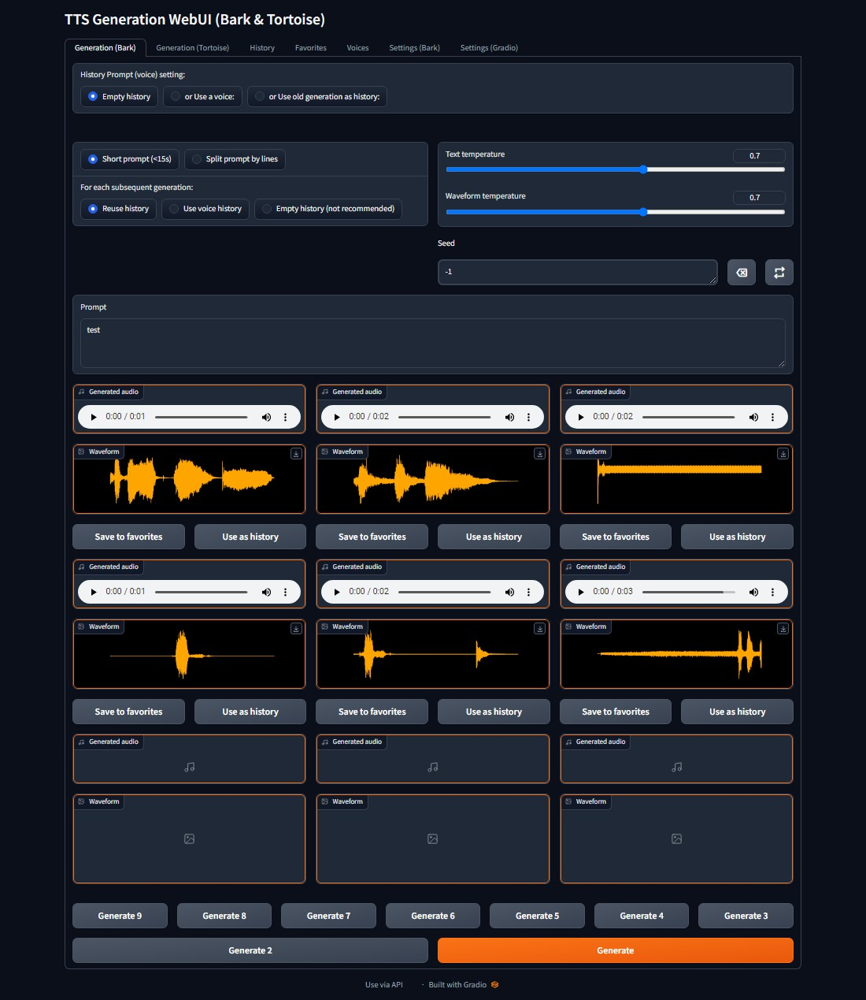
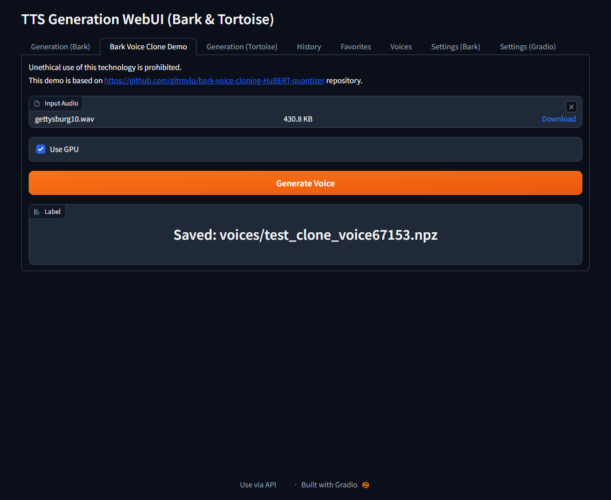

# TTS Generation WebUI (Bark v2, Tortoise)

## One click installers

[Download](https://github.com/rsxdalv/one-click-installers-tts/archive/refs/tags/v3.1.zip) ||
[Release Page](https://github.com/rsxdalv/one-click-installers-tts/releases/tag/v3.1) ||
[Installer Repo](https://github.com/rsxdalv/one-click-installers-tts)

## Screenshots

This code provides a Gradio interface for generating audio from text input using the Bark TTS and Tortoise TTS models. The interface takes a text prompt as input and generates audio as output.

.png)
.png)

[audio__bark__continued_generation__2023-05-04_16-07-49_long.webm](https://user-images.githubusercontent.com/6757283/236218842-b9dc253e-05de-49e5-ada9-e714e1e2cbd4.webm)

[audio__bark__continued_generation__2023-05-04_16-09-21_long.webm](https://user-images.githubusercontent.com/6757283/236219228-518d2b70-51a3-4175-af44-b24c01d14932.webm)

[audio__bark__continued_generation__2023-05-04_16-10-55_long.webm](https://user-images.githubusercontent.com/6757283/236219243-dad96404-0879-4274-828e-7f3afc6bac65.webm)

## Extra Voices
https://rsxdalv.github.io/bark-speaker-directory/ (https://github.com/rsxdalv/bark-speaker-directory)

## Dependencies

This code requires the following dependencies:

- `bark` in models/bark directory from https://github.com/suno-ai/bark
- `scipy`
- `gradio`

## Changelog
May 17:
* Update to v2 - generate results as they appear, preview long prompt generations piece by piece, enable up to 9 outputs, UI tweaks

May 16:
* Add gradio settings tab, fix gradio errors in console, improve logging.
* Update History and Favorites with "use as voice" and "save voice" buttons
* Add voices tab
* Bark tab: Remove "or Use last generation as history"
* Improve code organization

May 13:
* Enable deterministic generation and enhance generated logs. Credits to https://github.com/suno-ai/bark/pull/175.

May 10:
* Enable the possibility of reusing history prompts from older generations. Save generations as npz files. Add a convenient method of reusing any of the last 3 generations for the next prompts. Add a button for saving and collecting history prompts under /voices. https://github.com/rsxdalv/tts-generation-webui/pull/10

May 4:
* Long form generation (credits to https://github.com/suno-ai/bark/blob/main/notebooks/long_form_generation.ipynb and https://github.com/suno-ai/bark/issues/161)
* Adapt to fixed env var bug

May 3:
* Improved Tortoise UI: Voice, Preset and CVVP settings as well as ability to generate 3 results (https://github.com/rsxdalv/tts-generation-webui/pull/6)

May 2 Update 2:
* Added support for history recylcing to continue longer prompts manually

May 2 Update 1:
* Added support for v2 prompts

Before:
* Added support for Tortoise TTS

## To customize the installation, you may clone one of bark model forks within models/bark

git clone https://github.com/rsxdalv/bark.git
