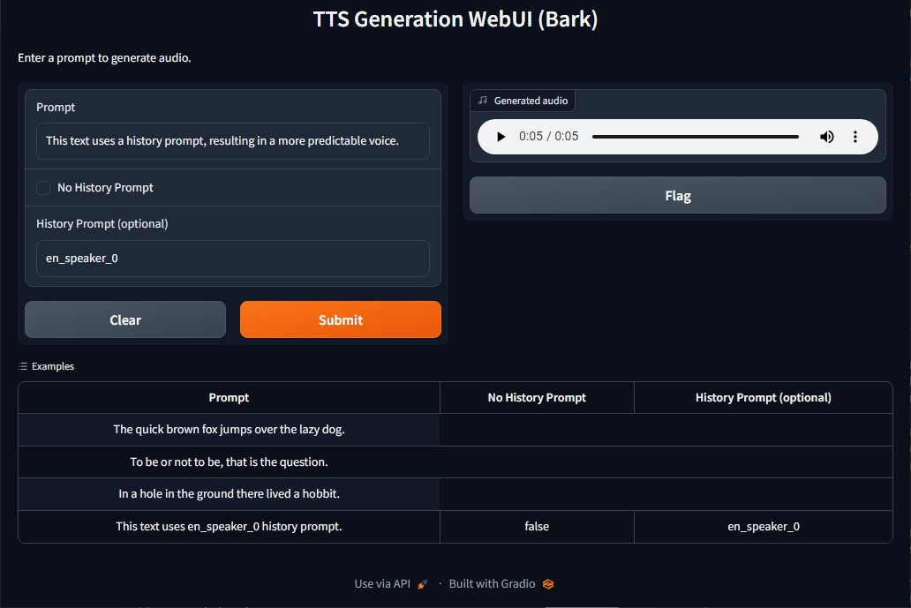

# TTS Generation WebUI (Bark)

This code provides a Gradio interface for generating audio from text input using the Bark TTS model. The interface takes a text prompt as input and generates audio as output.

## Dependencies

This code requires the following dependencies:

- `bark` in models/bark directory from https://github.com/suno-ai/bark
- `scipy`
- `gradio`

# Setup

## One click installers
https://github.com/rsxdalv/one-click-installers-tts

## To customize the installation, you may clone one of bark model forks within this directory

git clone https://github.com/rsxdalv/bark.git
