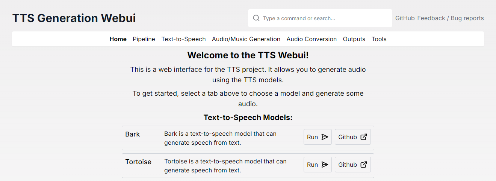

<h1 align="center">TTS Generation WebUI / Harmonica</h1>

<div align="center">

  <h3 align="center">

  [Download Installer](https://github.com/rsxdalv/tts-generation-webui/archive/refs/heads/main.zip) ||
  [Installation](#installation) ||
  [Docker Setup](#docker-setup) ||
  [Feedback / Bug reports](https://forms.gle/2L62owhBsGFzdFBC8)

  </h3>

  [](https://github.com/rsxdalv/tts-generation-webui)

  [](https://github.com/rsxdalv/tts-generation-webui/stargazers)
  [](https://github.com/rsxdalv/tts-generation-webui/blob/main/LICENSE)
  [](https://discord.gg/V8BKTVRtJ9)
  [](https://colab.research.google.com/github/rsxdalv/tts-generation-webui/blob/main/notebooks/google_colab.ipynb)
  [](https://github.com/rsxdalv/tts-generation-webui/network/members)

</div>

<div align="center">

## Videos

</div>

| [](https://youtu.be/Y8J717tr9t0) | [](https://youtu.be/ScN2ypewABc) | [](https://youtu.be/JXojhFjZ39k) |
| :------------------------------------------------------------------------------------------------------: | :------------------------------------------------------------------------------------------------------: | :------------------------------------------------------------------------------------------------------: |

<div align="center">

## Models

| Text-to-speech                | Audio/Music Generation       | Audio Conversion/Tools        |
|-------------------------------|------------------------------|-------------------------------|
| [Bark](https://github.com/suno-ai/bark) | [MusicGen](https://github.com/facebookresearch/audiocraft/blob/main/docs/MUSICGEN.md) | [RVC](https://github.com/RVC-Project/Retrieval-based-Voice-Conversion-WebUI) |
| [Tortoise](https://github.com/neonbjb/tortoise-tts) | [MAGNeT](https://github.com/facebookresearch/audiocraft/blob/main/docs/MAGNET.md) | [Demucs](https://github.com/facebookresearch/demucs) |
| [Maha TTS](https://github.com/dubverse-ai/MahaTTS) | [Stable Audio](https://github.com/Stability-AI/stable-audio-tools) | [Vocos](https://github.com/gemelo-ai/vocos) |
| [MMS](https://github.com/facebookresearch/fairseq/blob/main/examples/mms/README.md) | [(Extension) Riffusion](https://github.com/riffusion/riffusion-hobby) | [Whisper](https://github.com/openai/whisper) |
| [Vall-E X](https://github.com/Plachtaa/VALL-E-X) | [(Extension) AudioCraft Mac](https://github.com/trizko/audiocraft) | [AP BWE](https://github.com/yxlu-0102/AP-BWE) |
| [StyleTTS2](https://github.com/sidharthrajaram/StyleTTS2) | [(Extension) AudioCraft Plus](https://github.com/GrandaddyShmax/audiocraft_plus) | [Resemble Enhance](https://github.com/resemble-ai/resemble-enhance) |
| [SeamlessM4T](https://github.com/facebookresearch/seamless_communication) | | [Audio Separator](https://github.com/nomadkaraoke/python-audio-separator) |]
| [(Extension) XTTSv2](https://github.com/coqui-ai/TTS) | | |
| [(Extension) MARS5](https://github.com/camb-ai/mars5-tts) | | |
| [(Extension) F5-TTS](https://github.com/SWivid/F5-TTS) | | |
| [(Extension) Parler TTS](https://github.com/huggingface/parler-tts) | | |
| [(Extension) OpenVoice](https://github.com/myshell-ai/OpenVoice) | | |
| [(Extension) OpenVoice V2](https://github.com/myshell-ai/OpenVoice) | | |
| [(Extension) Kokoro TTS](https://github.com/hexgrad/kokoro) | | |
| [(Extension) DIA](https://github.com/nari-labs/dia) | | |
| [(Extension) CosyVoice](https://github.com/FunAudioLLM/CosyVoice) | | |
| [(Extension) GPT-SoVITS](https://github.com/X-T-E-R/GPT-SoVITS-Inference) | | |
| [(Extension) Piper TTS](https://github.com/rhasspy/piper) | | |
| [(Extension) Kimi Audio 7B Instruct](https://github.com/Dao-AILab/Kimi-Audio) | | |
| [(Extension) ACE-Step](https://github.com/ACE-Step/ACE-Step) | | |

</div>

<div align="center">

## Examples

</div>


| <video src="https://github.com/user-attachments/assets/16ac948a-fe98-49ad-ad87-19c41fe7e65e" width="300"></video> | <video src="https://github.com/user-attachments/assets/55bde4f7-bbcc-4ecf-8f94-b315b9d22e74" width="300"></video> | <video src="https://github.com/user-attachments/assets/fcee8906-a101-400d-8499-4e72c7603042" width="300"></video> |
| :-----------------------------------------: | :-----------------------------------------: | :-------------------------------: |

<div align="center">

## Screenshots

</div>

| .png) | .png) | .png) |
| :-----------------------------------------: | :-----------------------------------------: | :-------------------------------: |

| .png) | .png) | .png) |
| :-----------------------------------------: | :-----------------------------------------: | :-------------------------------: |

## Changelog

May 10:
* Fix missing directory bug causing extensions to fail to load. Thanks Discord/Comstock for discovery of the bug.
* Add ACE-Step to React UI.
* Add emoji to Gradio UI categories for simplicity.

May 7:
* Add [Piper TTS](https://github.com/rhasspy/piper) extension
* Add [ACE-Step](https://github.com/ACE-Step/ACE-Step) extension

May 6:
* Add Kimi Audio 7B Instruct extension
* Fix React-Gradio file proxy missing slash
* Add Kokoro TTS API extension

## April 2025

Apr 25:
* Add OpenVoice V2 extension

Apr 24:
* Add OpenVoice V1 extension

Apr 23:
* Deprecate requirements_* files using direct extension installation instead.
* Add proxy for gradio files in React UI.
* Added [DIA extension](https://github.com/nari-labs/dia).

Apr 22:
* Allow newer versions of pip
* Remove PyTorch's +cpu for Apple M Series Chip
* Installer fixes - fix CUDA repair, CRLF, warn about GCC, terminate if pip fails.

Apr 20:
* Fix install/uninstall in extension manager
* Add Kokoro TTS extension

Apr 18:
* Fix extension manager startup
* Convert most models to extensions, install the classic ones by default
* Attempt to fix linux installer
* Add 'recommended' flag for extensions

Apr 17:
* Create extension manager
* Warn Windows users if conda is installed
* upgrade dockerfile to PyTorch 2.6.0

Apr 12:
* Upgrade to PyTorch 2.6.0 Cuda 12.4, switch to pip for pytorch install
* Add compatibility layer for older models
* Fix StyleTTS2 missing nlkt downloader
* Reorder TTS tabs
* Allow disabled extensions to be configured in config.json
* Remove PyTorch CPU via pip option, redundant
* Move all core conda packages to init_mamba scripts.
* Upgrade the installer to include a web-based UI
* Add conda storage optimizer extension
* Hotfix: New init_app bug that caused the installer to freeze

Apr 11:
* Add AP BWE upscaling extension

Apr 02:
* Fix pydantic (#465, #468)
* Add --no-react --no-database advanced flags
* Add a fix to avoid directory errors on the very first React UI build (#466)

## March 2025

Mar 21:
* Add CosyVoice extension [Unstable] and GPT-SoVITS [Alpha] extension

Mar 20:
* Add executable macOS script for double-click launching
* Add unstable CosyVoice extension

Mar 18:
* Remove old rvc files
* Fix missing torchfcpe dependency for RVC

Mar 17:
* Upgrade Google Colab to PyTorch 2.6.0, add Conda to downgrade Python to 3.10
* No longer abort when the automatic update fails to fetch the new code (Improving offline support #457)
* Upgrade Tortoise to v3.0.1 for transformers 4.49.0 #454
* Prevent running in Windows/System32 folder #459

## February 2025

Feb 15:
* Fix Stable Audio to match the new version

Feb 14:
* Pin accelerate>=0.33.0 project wide
* Add basic Seamless M4T quantization code

Feb 13:
* Fix Stable Audio and Seamless M4T incompatibility
* Make Seamless M4T automatically use CUDA if available, otherwise CPU

Feb 10:
* Improve installation instructions in README

## January 2025


## 2024

<details>
<summary>Click to expand</summary>

See the [2024 Changelog](./documentation/changelog-2024.md) for a detailed list of changes in 2024.
</details>


## 2023
<details>
<summary>Click to expand</summary>

See the [2023 Changelog](./documentation/changelog-2023.md) for a detailed list of changes in 2023.
</details>

## Upgrading (For old installations)
*In case of issues, feel free to contact the developers*.

<details>
<summary>Click to expand</summary>

### Upgrading from v6 to new installer

#### Recommended: Fresh install
* Download the [new version](https://github.com/rsxdalv/tts-generation-webui/archive/refs/heads/main.zip) and run the start_tts_webui.bat (Windows) or start_tts_webui.sh (MacOS, Linux)
* Once it is finished, close the server.
* Recommended: Copy the old generations to the new directory, such as favorites/ outputs/ outputs-rvc/ models/ collections/ config.json
* With caution: you can copy the whole new tts-generation-webui directory over the old one, but there might be some old files that are lost.

#### In-place upgrade, can delete some files, tweaks
* Update the existing installation using the update_*platform* script
* After the update run the new start_tts_webui.bat (Windows) or start_tts_webui.sh (MacOS, Linux) inside of the tts-generation-webui directory
* Once the server starts, check if it works.
* With caution: if the new server works, within the one-click-installers directory, delete the old installer_files.

#### *Is there any more optimal way to do this?*

Not exactly, the dependencies clash, especially between conda and python (and dependencies are already in a critical state, moving them to conda is ways off). Therefore, while it might be possible to just replace the old installer with the new one and running the update, the problems are unpredictable and **unfixable**. Making an update to installer requires a lot of testing so it's not done lightly.

</details>

## Installation
* Download the [latest version](https://github.com/rsxdalv/tts-generation-webui/archive/refs/heads/main.zip) and extract it.
* Run start_tts_webui.bat or start_tts_webui.sh to start the server. It will ask you to select the GPU/Chip you are using. Once everything has installed, it will start the Gradio server at http://localhost:7770 and the React UI at http://localhost:3000.
* Output log will be available in the installer_scripts/output.log file.
* Note: The start script sets up a conda environment and a python virtual environment. Thus you don't need to make a venv before that, and in fact, launching from another venv might break this script.

### Manual installation (not recommended)

For detailed manual installation instructions, please refer to the [Manual Installation Guide](./documentation/manual_installation.md).

### Docker Setup

tts-generation-webui can also be ran inside of a Docker container. Using CUDA inside of docker requires (NVIDIA Container Toolkit)[https://docs.nvidia.com/datacenter/cloud-native/container-toolkit/latest/install-guide.html]. To get started, pull the image from GitHub Container Registry:

```
docker pull ghcr.io/rsxdalv/tts-generation-webui:main
```

Once the image has been pulled it can be started with Docker Compose:
The ports are 7770 (env:TTS_PORT) for the Gradio backend and 3000 (env:UI_PORT) for the React front end.

```
docker compose up -d
```

The container will take some time to generate the first output while models are downloaded in the background. The status of this download can be verified by checking the container logs:

```
docker logs tts-generation-webui
```

#### Building the image yourself
If you wish to build your own docker container, you can use the included Dockerfile:

```
docker build -t tts-generation-webui .
```
Please note that the docker-compose needs to be edited to use the image you just built.


## Compatibility / Errors

Audiocraft is currently only compatible with Linux and Windows. MacOS support still has not arrived, although it might be possible to install manually.

### Torch being reinstalled

Due to the python package manager (pip) limitations, torch can get reinstalled several times. This is a wide ranging issue of pip and torch.

### Red messages in console
These messages:
```
---- requires ----, but you have ---- which is incompatible.
```
Are completely normal. It's both a limitation of pip and because this Web UI combines a lot of different AI projects together. Since the projects are not always compatible with each other, they will complain about the other projects being installed. This is normal and expected. And in the end, despite the warnings/errors the projects will work together.
It's not clear if this situation will ever be resolvable, but that is the hope.


## Extra Voices for Bark, Prompt Samples
<div align="center">

[](https://promptecho.com/)

[](https://rsxdalv.github.io/bark-speaker-directory/)

</div>

## Bark Readme
[README_Bark.md](./documentation/README_Bark.md)

## Info about managing models, caches and system space for AI projects
https://github.com/rsxdalv/tts-generation-webui/discussions/186#discussioncomment-7291274


## Open Source Libraries

<details>
<summary>This project utilizes the following open source libraries:</summary>

- **suno-ai/bark** - [MIT License](https://github.com/suno-ai/bark/blob/main/LICENSE)
  - Description: Inference code for Bark model.
  - Repository: [suno/bark](https://github.com/suno-ai/bark)

- **tortoise-tts** - [Apache-2.0 License](https://github.com/neonbjb/tortoise-tts/blob/master/LICENSE)
  - Description: A flexible text-to-speech synthesis library for various platforms.
  - Repository: [neonbjb/tortoise-tts](https://github.com/neonbjb/tortoise-tts)

- **ffmpeg** - [LGPL License](https://github.com/FFmpeg/FFmpeg/blob/master/LICENSE.md)
  - Description: A complete and cross-platform solution for video and audio processing.
  - Repository: [FFmpeg](https://github.com/FFmpeg/FFmpeg)
  - Use: Encoding Vorbis Ogg files

- **ffmpeg-python** - [Apache 2.0 License](https://github.com/kkroening/ffmpeg-python/blob/master/LICENSE)
  - Description: Python bindings for FFmpeg library for handling multimedia files.
  - Repository: [kkroening/ffmpeg-python](https://github.com/kkroening/ffmpeg-python)

- **audiocraft** - [MIT License](https://github.com/facebookresearch/audiocraft/blob/main/LICENSE)
  - Description: A library for audio generation and MusicGen.
  - Repository: [facebookresearch/audiocraft](https://github.com/facebookresearch/audiocraft)

- **vocos** - [MIT License](https://github.com/charactr-platform/vocos/blob/master/LICENSE)
  - Description: An improved decoder for encodec samples
  - Repository: [charactr-platform/vocos](https://github.com/charactr-platform/vocos)

- **RVC** - [MIT License](https://github.com/RVC-Project/Retrieval-based-Voice-Conversion-WebUI/blob/main/LICENSE)
  - Description: An easy-to-use Voice Conversion framework based on VITS.
  - Repository: [RVC-Project/Retrieval-based-Voice-Conversion-WebUI](https://github.com/RVC-Project/Retrieval-based-Voice-Conversion-WebUI)
</details>

## Ethical and Responsible Use
This technology is intended for enablement and creativity, not for harm.

By engaging with this AI model, you acknowledge and agree to abide by these guidelines, employing the AI model in a responsible, ethical, and legal manner.
- Non-Malicious Intent: Do not use this AI model for malicious, harmful, or unlawful activities. It should only be used for lawful and ethical purposes that promote positive engagement, knowledge sharing, and constructive conversations.
- No Impersonation: Do not use this AI model to impersonate or misrepresent yourself as someone else, including individuals, organizations, or entities. It should not be used to deceive, defraud, or manipulate others.
- No Fraudulent Activities: This AI model must not be used for fraudulent purposes, such as financial scams, phishing attempts, or any form of deceitful practices aimed at acquiring sensitive information, monetary gain, or unauthorized access to systems.
- Legal Compliance: Ensure that your use of this AI model complies with applicable laws, regulations, and policies regarding AI usage, data protection, privacy, intellectual property, and any other relevant legal obligations in your jurisdiction.
- Acknowledgement: By engaging with this AI model, you acknowledge and agree to abide by these guidelines, using the AI model in a responsible, ethical, and legal manner.

## License

### Codebase and Dependencies

The codebase is licensed under MIT. However, it's important to note that when installing the dependencies, you will also be subject to their respective licenses. Although most of these licenses are permissive, there may be some that are not. Therefore, it's essential to understand that the permissive license only applies to the codebase itself, not the entire project.

That being said, the goal is to maintain MIT compatibility throughout the project. If you come across a dependency that is not compatible with the MIT license, please feel free to open an issue and bring it to our attention.

Known non-permissive dependencies:
| Library     | License           | Notes                                                                                     |
|-------------|-------------------|-------------------------------------------------------------------------------------------|
| encodec     | CC BY-NC 4.0      | Newer versions are MIT, but need to be installed manually                                  |
| diffq       | CC BY-NC 4.0      | Optional in the future, not necessary to run, can be uninstalled, should be updated with demucs |
| lameenc     | GPL License       | Future versions will make it LGPL, but need to be installed manually                      |
| unidecode   | GPL License       | Not mission critical, can be replaced with another library, issue: https://github.com/neonbjb/tortoise-tts/issues/494 |


### Model Weights
Model weights have different licenses, please pay attention to the license of the model you are using.

Most notably:
- Bark: MIT
- Tortoise: *Unknown* (Apache-2.0 according to repo, but no license file in HuggingFace)
- MusicGen: CC BY-NC 4.0
- AudioGen: CC BY-NC 4.0

